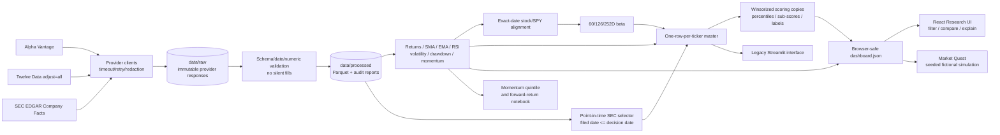

# W3-15 — QuantDash architecture

## Boundaries

- Provider access and secret keys remain in Python; the browser receives no keys.
- Live UI interactions read one validated static snapshot and make no provider
  calls.
- Missing values remain explicit throughout the pipeline.
- The Market Quest scenario is fictional, deterministic, and separate from the
  real research snapshot.
